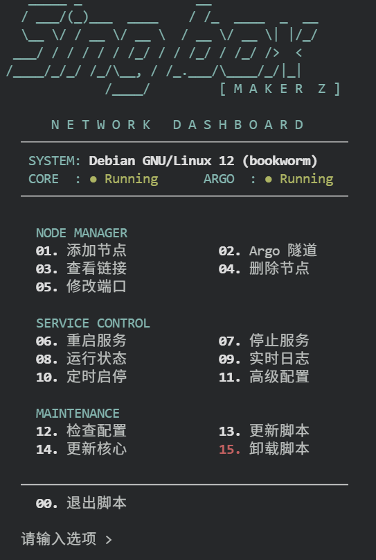
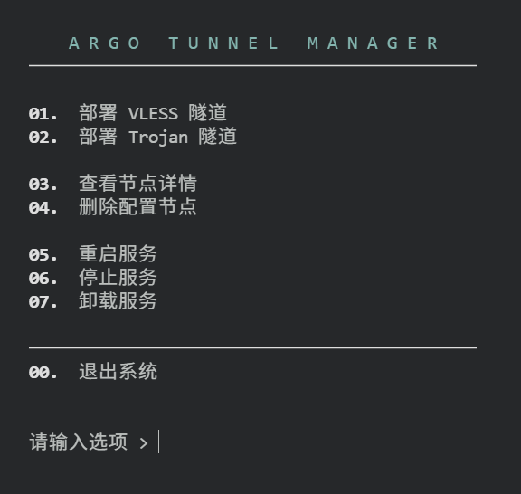
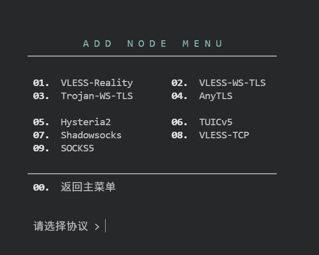
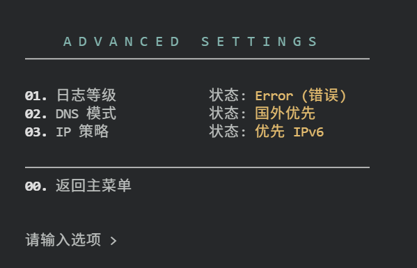

# Singbox Maker Z

**次世代网络流量编排引擎：轻量级、模块化与全托管的完美平衡**

Singbox Maker Z 是一个专注于资源受限环境下的高可用流量代理编排方案。它不只是简单的安装脚本，而是一套严谨的、采用模块化架构设计的服务管理框架。

---

### 设计哲学：极简主义与卓越性能

在云计算的边缘地带，每一兆字节的内存都至关重要。Singbox Maker Z 针对 128MB 甚至更低规格的 VPS 进行了底层优化，确保系统保持绝对的静默与稳定。

#### 1. 模块化工程架构 (Modular Engineering)

项目采用分层架构设计，确保了系统的可维护性与扩展性：

* **内核控制器 (`singbox.sh`)**：负责高层逻辑调度与交互式指令集。
* **模块加载器 (`utils.sh`)**：实现组件的热插拔与环境兼容性注入。
* **功能库 (`lib/`)**：涵盖网络、系统、内存及服务管理的原子化操作。

#### 2. 精准资源分配 (Precision Resource Allocation)

内置智能内存估算算法，通过动态计算 `GOMEMLIMIT` 强制约束核心进程，从根本上杜绝 OOM 崩溃风险。

#### 3. Argo 隧道深度集成 (Advanced Argo Integration)

针对 Cloudflare Argo 隧道提供了全方位的生命周期支持：

* **自愈系统 (Watchdog)**：内置分钟级链路检测机制，一旦识别断连即刻自动拉起。
* **多模式编排**：支持无需配置的临时隧道与基于 Token 的固定商业隧道。

---

### 运维指南：效率驱动的交互体验

#### 节点编排 (Node Orchestration)

通过高度集成的指令集，管理员可以在数秒内完成复杂协议栈的构建：

* **协议矩阵**：一键并行部署 VLESS-Reality、Hysteria2 与 TUIC v5 等主流协议。
* **极速模式 (`sb -q`)**：自动处理端口冲突校验与 SNI 伪装。

#### 定时生命周期编排 (Temporal Orchestration)

赋予服务器“作息时间”，实现更高级的安全与成本管理：

* **定时启停**：精确定义服务的活跃窗口（如：每天 08:30 唤醒，01:00 休眠）。
* **静默释放**：休眠期间彻底清理内存占用与防火墙痕迹。

---

### 技术指标 (Technical Specifications)

| 维度 | 规范说明 | 技术实现 |
| --- | --- | --- |
| **支持架构** | x86_64, arm64, armv7 | 自动架构检测 |
| **初始化系统** | Systemd, OpenRC | 跨平台兼容层 |
| **核心协议** | Reality, Hy2, TUIC, Argo, SS | 全协议矩阵支持 |
| **高级设置** | 日志等级、DNS模式、IP策略 | 动态配置注入 |

---

### 系统目录规范

* **配置路径**：`/usr/local/etc/sing-box/` (存储 JSON 配置、证书与元数据)
* **程序路径**：`/usr/local/share/singbox-maker-z/` (存储模块化脚本组件)
* **日志路径**：`/var/log/sing-box.log` (支持自动清理的系统日志)

---

**致谢**：本方案基于 [singbox-lite](https://github.com/0xdabiaoge/singbox-lite) 进行了深度重构与功能演进。

